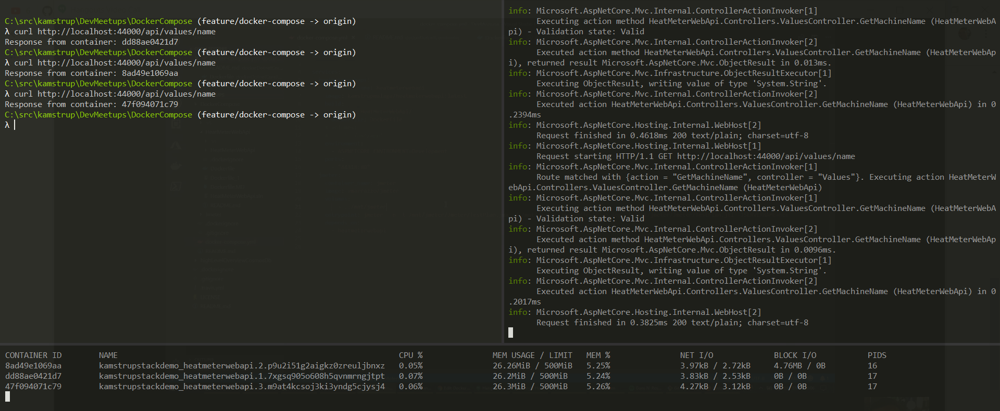

# Docker Compose & Swarm

# Agenda

- Intro about Docker, Docker-Compose and Docker Swarm
- Scaling containers
- Use Pumba Chaos to take down containers and see how they restart.
- Configure resource constraints. Set restrictions in CPU and Memory usage (tell story about R calculation high memory usage). https://docs.docker.com/compose/compose-file/

# Getting started

- Install latest Docker compose: https://docs.docker.com/compose/install/

# Intro

*Compose is a tool for defining and running multi-container Docker applications. With Compose, you use a YAML file to configure your application’s services. Then, with a single command, you create and start all the services from your configuration.*

# Docker Swarm

## Init the swarm

    λ docker swarm init

    Swarm initialized: current node (usb01xak7e7ypzr4nzd6jvmpu) is now a manager.

    To add a worker to this swarm, run the following command:

    docker swarm join --token SWMTKN-1-3t57uirhpdxha95qhsnkh91t4nhniqu7w5krd329nfrl8v6drg-cvy6abe1dh49bt4oqeys0iyh3 192.168.65.3:2377

    To add a manager to this swarm, run 'docker swarm join-token manager' and follow the instructions.

## Deploy the stack to the swarm
Create the stack with docker stack deploy:

    λ docker stack deploy --compose-file docker-compose.yml kamstrupstackdemo

    Creating network kamstrupstackdemo_default
    Creating service kamstrupstackdemo_heatwebapi

Check that it’s running with docker stack services kamstrupstackdemo:

    λ docker stack services kamstrupstackdemo

    ID            NAME             MODE        REPLICAS  IMAGE
    oi1iyupzg2s0        kamstrupstackdemo_heatmeterwebapi   replicated          3/3                 kamstrupmalaga/heatmeterwebapi:latest   *:44000->80/tcp

Once it’s running, you should see `3/3` under REPLICAS for the service. This might take some time if you have a multi-node swarm, as images need to be pulled.

You can test the app with curl:

    λ curl http://localhost:44000/api/values/name
    Response from container: dd88ae0421d7

    λ curl http://localhost:44000/api/values/name
    Response from container: 8ad49e1069aa
    
    λ curl http://localhost:44000/api/values/name
    Response from container: 47f094071c79        

## Bring the stack down

Bring the stack down with docker stack rm:

    λ docker stack rm kamstrupstackdemo

    Removing service kamstrupstackdemo_heatmeterwebapi
    Removing network kamstrupstackdemo_default    

To bring your Docker Engine out of swarm mode

    λ docker swarm leave --force
    
    Node left the swarm.

# Architectural diagram

// TODO

# Resources
- Link to .ppt slides
- [Deploy a stack to a swarm](https://docs.docker.com/engine/swarm/stack-deploy/)
- https://hackernoon.com/practical-introduction-to-docker-compose-d34e79c4c2b6
